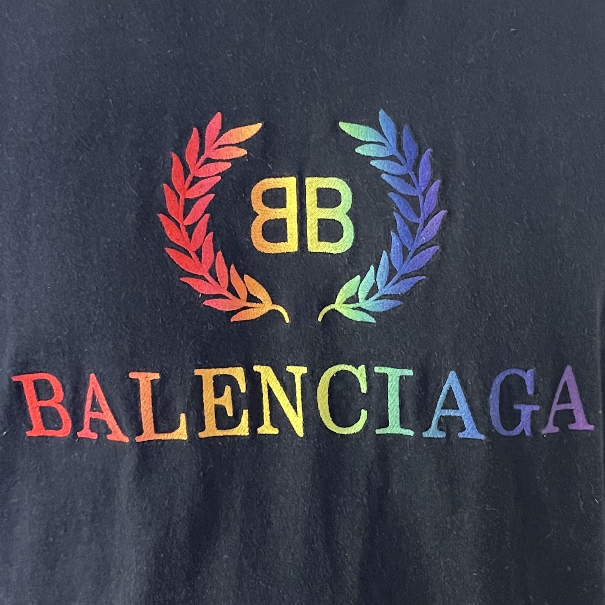
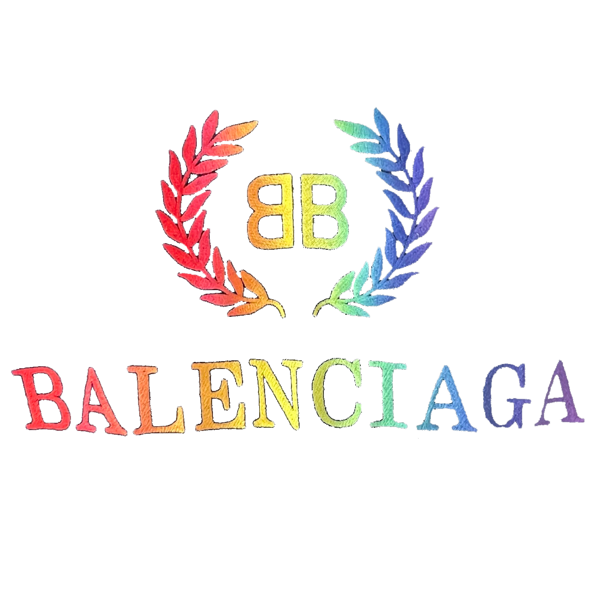
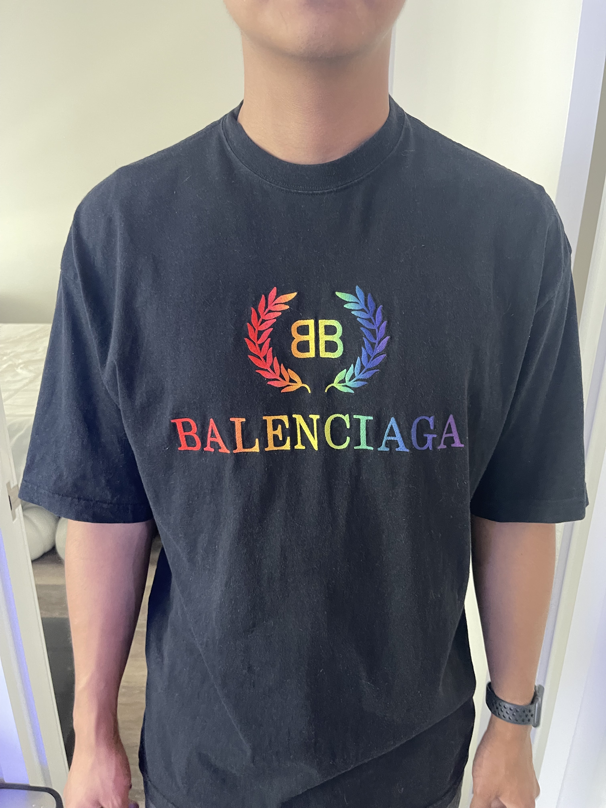

### Balenciaga Pride AR Shirt

Made with Photoshop, Premeire Pro, A-Frame, and 8th Wall.


### Make it your own

Make this experience in 5 steps, or, watch the [video tutorial](https://www.youtube.com/watch?v=rQf8bSVY3QQ) (starts at 28 minutes).

1. First, take a photo of someone wearing a shirt with a design and crop the image to a perfect square.



2. Removed everything except for the logo using Adobe Photoshop or similar.



3. Use the logo as a mask over a video of a rainbow gradient (also exported as a perfect square).

todo: make a tutorial

4. Finally, upload the image target (the square from step 1)

5. Add the video as a child of the `<named-image-target>` to a square plane in `body.html`. Use the chromakey shader to remove the black background.

```
  <xrextras-named-image-target name="shirt">
    <a-plane id="videoEl" material="shader: chromakey; src: #video; color: 0 0 0; opacity: 0"></a-plane>
  </xrextras-named-image-target>
```

### Try the experience yourself



---

### Your Exported Project
This zip contains your project source code, assets, image targets, and configuration needed to build and publish your 8th Wall project. It does not connect to any 8th Wall services, so will work even after the 8th Wall servers are shut down.

### Setup
If node/npm are not installed, install using https://github.com/nvm-sh/nvm or https://nodejs.org/en/download.

Run `npm install` in this folder.

### Development
Run `npm run serve` to run the development server.

#### Testing on Mobile
To test your project on mobile devices, especially for AR experiences that require camera access, you'll need to serve your development server over HTTPS. We recommend using [ngrok](https://ngrok.com/) to create a secure tunnel to your local server. After setting up ngrok, add the following configuration to `config/webpack.config.js` under the `devServer` section:

```javascript
devServer: {
  // ... existing config
  allowedHosts: ['.ngrok-free.dev']
}
```

### Publishing
Run `npm run build` to generate a production build. The resulting build will be in `dist/`. You can host this bundle on any web server you want.

### Project Overview
- `src/`: Contains all your original project code and assets.
    - References to asset bundles will need to be updated. Asset bundles are now plain folders. For example,
      - GLTF bundles need to be updated to the `.gltf` file in the folder, i.e., if your model is at `assets/mymodel.gltf/`, update your code to reference `assets/mymodel.gltf/mymodel_file.gltf`.
- `image-targets/`: Contains your project's image targets (if any).
  - The image target with the `_luminance` suffix is the image target loaded by the engine. The others are used for various display purposes, but are exported for your convenience.
  - To enable image targets, call this in `app.js` or `app.ts` file. (Note: `app.js` or `app.ts` may not be created by default; you will need to create this file yourself.) The autoload targets will have a `"loadAutomatically": true` property in their json file.
```javascript
const onxrloaded = () => {
  XR8.XrController.configure({
    imageTargetData: [
      require('../image-targets/target1.json'),
      require('../image-targets/target2.json'),
    ],
  })
}
window.XR8 ? onxrloaded() : window.addEventListener('xrloaded', onxrloaded)
```
- `config/`: Contains the necessary webpack configuration and typescript definitions to support project development.
- `external/`: Contains dependencies used by your project, loaded in `index.html`.
  - If you are not using the XR Engine, you can remove the xr.js script tag from `index.html` and delete the `external/xr/` folder to save bandwidth.
  - You can also customize whether `face`, `slam`, or both, are loaded on the `data-preload-chunks` attribute.
